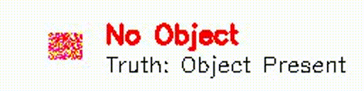

# Object Detection with Logistic Regression

A simple object detection system using logistic regression. The system can detect objects (red rectangles) in images using various image features.

## Demo



The demo shows:
- Left side: Input image (red rectangle = object present)
- Right side: Model prediction and ground truth
- Text color indicates prediction accuracy:
  - Green = Correct prediction
  - Red = Incorrect prediction

## Features

- Custom dataset generation
- Feature extraction from images
- Logistic regression model training
- Performance visualization
- Model persistence

## Installation

```bash
pip install -r requirements.txt
```

## Usage

Run the main script:
```bash
python custom_detection.py
```

To run the demo:
```bash
python demo.py
```

## Project Structure

- `custom_detection.py`: Main script
- `demo.py`: Demo script for visualization
- `dataset/`: Generated dataset directory
- `object_detection_model.joblib`: Trained model
- `object_detection_scaler.joblib`: Feature scaler
- `confusion_matrix.png`: Model performance visualization
- `demo.mp4`: Demo video showing detection in action

## Requirements

- Python 3.13
- NumPy
- Pandas
- Scikit-learn
- OpenCV
- Seaborn
- Matplotlib 